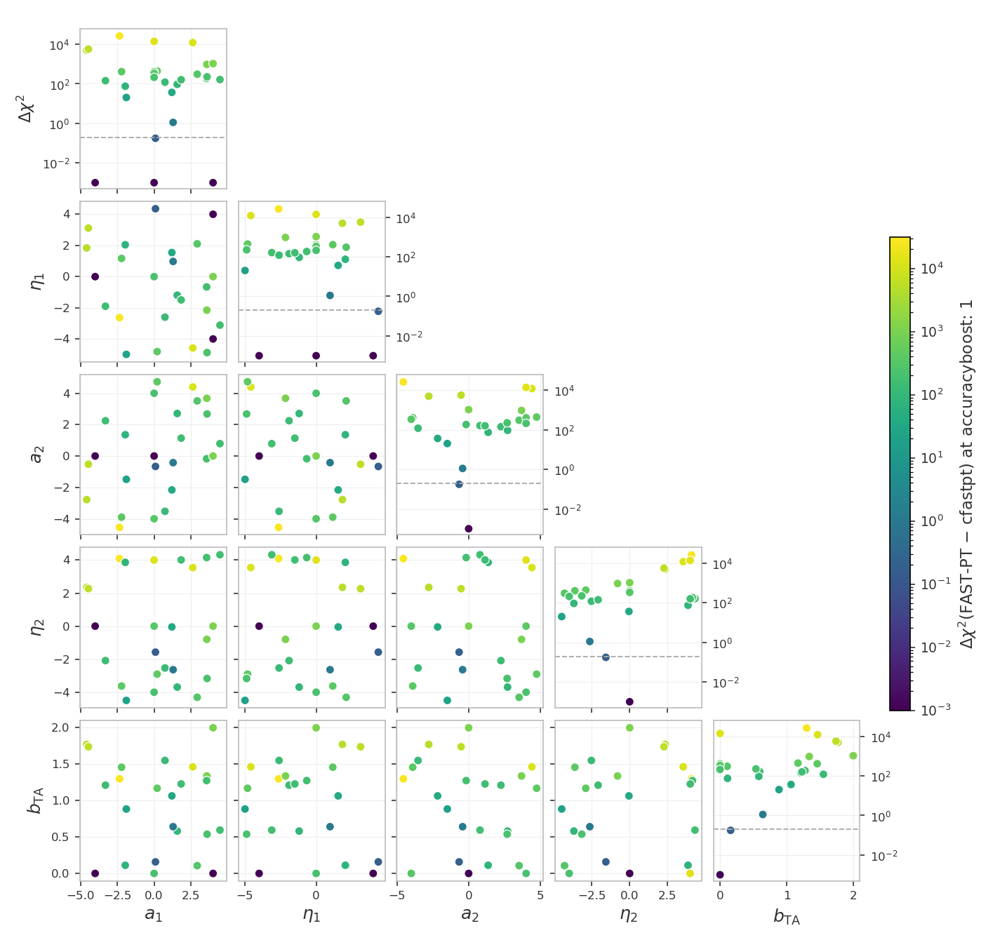

## Running Cosmolike projects (Basic instructions)  

From `Cocoa/Readme` instructions:

> [!Note]
> We provide several cosmolike projects that can be loaded and compiled using `setup_cocoa.sh` and `compile_cocoa.sh` scripts. To activate them, comment the following lines on `set_installation_options.sh` 
> 
>     [Adapted from Cocoa/set_installation_options.sh shell script]
>     (...)
>
>     # ------------------------------------------------------------------------------
>     # The keys below control which cosmolike projects will be installed and compiled
>     # ------------------------------------------------------------------------------
>     #export IGNORE_COSMOLIKE_LSST_Y1_CODE=1
>     #export IGNORE_COSMOLIKE_DES_Y3_CODE=1
>     export IGNORE_COSMOLIKE_ROMAN_KL_CODE=1
>
>     (...)
>     # ------------------------------------------------------------------------------
>     # Cosmolike projects below -------------------------------------------
>     # ------------------------------------------------------------------------------
>     (...)
>     export ROMAN_KL_URL="https://github.com/CosmoLike/cocoa_roman_kl.git"
>     export ROMAN_KL_NAME="roman_kl"
>     #Pin the project version with at most one of the keys below (COMMIT, BRANCH, or TAG).
>     #If more than one is set, COMMIT wins over BRANCH, and BRANCH wins over TAG.
>     #If none is set, Cocoa loads the latest commit on the repository default branch.
>     #export ROMAN_KL_GIT_BRANCH="main"
>     #export ROMAN_KL_GIT_COMMIT="abc"
>     export ROMAN_KL_GIT_TAG="v4.11.0"

> [!NOTE]
> If users want to recompile cosmolike, there is no need to rerun the Cocoa general scripts. Instead, run the following three commands:
>
>      source start_cocoa.sh
>
> and
> 
>      source ./installation_scripts/setup_cosmolike_projects.sh
>
> and
> 
>       source ./installation_scripts/compile_all_projects.sh
> 
> or (in case users just want to compile roman_kl project)
>
>       source ./projects/roman_kl/scripts/compile_roman_kl.sh

To run the example

 **Step :one:**: activate the cocoa Conda environment,  and the private Python environment 

      conda activate cocoa

and

      source start_cocoa.sh
 
 **Step :two:**: Select the number of OpenMP cores (below, we set it to 8).

  - Linux
    
        export OMP_NUM_THREADS=8; export OMP_PROC_BIND=close; \
        export OMP_PLACES=cores; export OMP_DYNAMIC=FALSE; \
        export OPENBLAS_NUM_THREADS=1; export MKL_NUM_THREADS=1

  - macOS (arm)
    
        export OMP_NUM_THREADS=8; export OMP_PROC_BIND=disabled; \
        export OMP_PLACES=cores; export OMP_DYNAMIC=FALSE; \
        export OPENBLAS_NUM_THREADS=1; export MKL_NUM_THREADS=1

 **Step :three:**: The folder `projects/roman_kl` contains examples. So, run the `cobaya-run` on the first example following the commands below.

> [!Warning] 
> (Linux only) In some HPC nodes, `numa` can cause you problems. If that is the case,
> replace `numa` with `slot`

- **One model evaluation**:

  - Linux

        "${CONDA_PREFIX}"/bin/mpirun -n 1 --oversubscribe \
          --mca pml ob1 --mca btl vader,tcp,self \
          --bind-to core:overload-allowed --report-bindings \
          --rank-by slot --map-by numa:pe=${OMP_NUM_THREADS} \
          cobaya-run ./projects/roman_kl/EXAMPLE_EVALUATE1.yaml -f

  - macOS (arm)

        mpirun -n 1 --oversubscribe \
          cobaya-run ./projects/roman_kl/EXAMPLE_EVALUATE1.yaml -f

- **MCMC (Metropolis-Hastings Algorithm)**:

  - Linux

        "${CONDA_PREFIX}"/bin/mpirun -n 4 --oversubscribe \
          --mca pml ob1 --mca btl vader,tcp,self \
          --bind-to core:overload-allowed --report-bindings \
          --rank-by slot --map-by numa:pe=${OMP_NUM_THREADS} \
          cobaya-run ./projects/roman_kl/EXAMPLE_MCMC1.yaml -f

  - macOS (arm)

        mpirun -n 4 --oversubscribe \
          cobaya-run ./projects/roman_kl/EXAMPLE_MCMC1.yaml -f

# Baryonic feedback on EXAMPLE_EVALUATE1 

`EXAMPLE_EVALUATE1.yaml` can apply an external baryonic feedback suppression to the
matter power spectrum via the `bfmt` theory block (SP(k), BCEmu, Flamingo, BACCOemu,
or BCemu2025). By default, the example runs without feedback.

**Step :one:**: ensure the lines below are commented out in `set_installation_options.sh`
before running `setup_cocoa.sh` and `compile_cocoa.sh`. *By default, these lines should
be commented out, but it is worth checking*.

      [Adapted from Cocoa/set_installation_options.sh shell script]
      #export IGNORE_PYSPK_CODE=1     # SP(k)
      #export IGNORE_BCEMU_CODE=1     # BCEmu
      #export IGNORE_FBRE_CODE=1      # FlamingoBaryonResponseEmulator
      #export IGNORE_BACCOEMU_CODE=1  # BACCOemu
      #export IGNORE_BFMT_CODE=1      # Baryon Feedback Theory Block

**Step :two:**: in `EXAMPLE_EVALUATE1.yaml`, uncomment the `bfmt` theory block and select
the model:

      theory:
        bfmt:
          baryon_model: 2 # 1 = SP(k), 2 = BCEmu, 3 = FlamingoEmulator, 4 = BACCOemu, 5 = BCemu2025

**Step :three:**: set `external_baryon_suppression: True` on the `roman_kl.cosmic_shear`
likelihood block.

**Step :four:**: uncomment the selected model's parameters in the `params` block and in
the `sampler: evaluate: override` block (the example carries a commented block for each
model).

> [!TIP]
> For the sampled parameters of each model, their validity ranges, and the `bfmt`
> options, see `Cocoa/external_modules/code/baryon_suppression/README.md`.

# Table of contents 

1. [Baryonic feedback on EXAMPLE_EVALUATE1](#roman_kl_baryonic_feedback)
2. [Running Hybrid Cosmolike-ML emulators](#roman_kl_examples_emul2)
3. [Unit tests](#unit_tests)
4. [FAST-PT accuracy for TATT (`IA_code: 1`)](#fastpt_accuracy)

# Running Hybrid Cosmolike-ML emulators 

> [!Warning]
> The code and examples associated with this section are still in alpha stage

While our data vector emulators are incredibly fast, there is an intermediate 
approach that emulates only the Boltzmann outputs (comoving distance, linear and 
nonlinear matter power spectrum). This hybrid-ML case can offer greater flexibility, 
especially in the initial phases of a research project, as changes to the modeling 
of nuisance parameters or to the assumed galaxy distributions do not require 
retraining of the network. 

Examples in the hybrid case all have the prefix **EXAMPLE_EMUL2** (note the `2`). The required flags on `set_installation_options.sh` are similar to what we showed in the previous emulator section.

Now, users must follow all the steps below.

 **Step :one:**: Activate the private Python environment by sourcing the script `start_cocoa.sh`

    source start_cocoa.sh

 **Step :two:**: Select the number of OpenMP cores. Below, we set it to 4, the ideal setting for hybrid examples.

  - Linux

        export OMP_NUM_THREADS=4; export OMP_PROC_BIND=close; \
        export OMP_PLACES=cores; export OMP_DYNAMIC=FALSE; \
        export OPENBLAS_NUM_THREADS=1; export MKL_NUM_THREADS=1

  - macOS (arm)
    
        export OMP_NUM_THREADS=4; export OMP_PROC_BIND=disabled; \
        export OMP_PLACES=cores; export OMP_DYNAMIC=FALSE; \
        export OPENBLAS_NUM_THREADS=1; export MKL_NUM_THREADS=1

 **Step :three:** Run `cobaya-run` on the first emulator example, following the commands below.

- **One model evaluation**:

  - Linux

        "${CONDA_PREFIX}"/bin/mpirun -n 1 --oversubscribe \
          --mca pml ob1 --mca btl vader,tcp,self \
          --bind-to core:overload-allowed --report-bindings \
          --rank-by slot --map-by numa:pe=${OMP_NUM_THREADS} \
          cobaya-run ./projects/roman_kl/EXAMPLE_EMUL2_EVALUATE1.yaml -f

  - macOS (arm)
    
        mpirun -n 1 --oversubscribe \
          cobaya-run ./projects/roman_kl/EXAMPLE_EMUL2_EVALUATE1.yaml -f

- **MCMC (Metropolis-Hastings Algorithm)**:

  - Linux

        "${CONDA_PREFIX}"/bin/mpirun -n 4 --oversubscribe \
          --mca pml ob1 --mca btl vader,tcp,self \
          --bind-to core:overload-allowed --report-bindings \
          --rank-by slot --map-by numa:pe=${OMP_NUM_THREADS} \
          cobaya-run ./projects/roman_kl/EXAMPLE_EMUL2_MCMC1.yaml -r

  - macOS (arm)

        mpirun -n 4 --oversubscribe \
          cobaya-run ./projects/roman_kl/EXAMPLE_EMUL2_MCMC1.yaml -r

> [!NOTE]
> **Running on more than one node.** The flag `--mca btl vader,tcp,self` works unchanged across
> nodes: Open MPI picks the transport per pair of ranks, using shared memory (`vader`) within a
> node and TCP between nodes. Three things deserve attention on multi-node runs:
>
> 1. **Network interface.** The TCP layer must not select an interface that is not routable
>    between compute nodes. The flag `--mca btl_tcp_if_exclude lo,docker0,virbr0,ib0` excludes
>    the common offenders. TCP bandwidth is not a limitation for our workloads, which exchange
>    small, infrequent MPI messages.
>
> 2. **Environment.** Ranks on remote nodes must see Cocoa's environment (`ROOTDIR`, `PATH`,
>    `LD_LIBRARY_PATH`, `PYTHONPATH`, `CONDA_PREFIX`, the OpenMP/BLAS thread settings, and
>    `CLIK_PATH`/`CLIK_DATA`/`CLIK_PLUGIN`). Slurm forwards the submitting environment
>    automatically; the explicit `-x` flags in our sbatch templates repeat this so the
>    scripts also work under ssh-based launchers. No other Cocoa installation flags are read at runtime.
>
> 3. **Slurm geometry.** Keep `ntasks-per-node` × `cpus-per-task` no larger than the cores per
>    node, and use `--map-by numa:pe=${OMP_NUM_THREADS}` so each rank reserves the cores its
>    OpenMP threads will use.

> [!NOTE]
> **Note on core oversubscription**: an MPI process that is waiting still burns 100% of its
> core, checking for messages in a loop. With more processes than cores, this stalls the
> processes doing real work. Open MPI usually detects this and makes waiting processes give
> up the CPU, but its detection can be fooled. Adding `--mca mpi_yield_when_idle 1` forces
> that behavior; it is harmless otherwise.

## Historical Notes

- The corresponding `cosmolike_core` branch for the `generic_interface.cpp` parser fix is `nonlimber-dev`.
- A typical failure signature is:
  `[critical] read_table: failed to parse file external_modules/data/roman_kl/Roman_3x2pt_cov_Ncl20_Ntomo10 at data line 12401, column 9: token='1.630861e-316' (out of range)`
- `Roman_3x2pt_cov_Ncl20_Ntomo10` can contain extremely small subnormal entries such as `1.630861e-316`.
- The original `read_table` implementation in `cosmolike_core/cosmolike/generic_interface.cpp` used `std::stod`, which raised a range error on these finite underflowed values and stopped likelihood initialization.
- The fix is to parse table values with `std::strtod` and only treat range errors as fatal when the parsed result is non-finite. Finite underflowed values are accepted.
- If you see this error, switch `Cocoa/external_modules/code/cosmolike_core` to branch `nonlimber-dev` or apply the same `generic_interface.cpp` patch, then rebuild `projects/roman_kl/interface/cosmolike_roman_kl_interface.so`.

# Unit tests 

The `tests/` folder holds unit tests for the likelihoods of this
project: they compare each likelihood against stored reference
values, check for race conditions from OpenMP threading, and measure
the numerical error of the default accuracy settings, and the accuracy of the
hybrid emulated pipelines. The
tests read nothing from the live project;
[tests/README.md](tests/README.md) describes every test, the tests'
own data snapshot, and how to refresh it.

We assume users are in the Conda cocoa environment from a previous
`conda activate cocoa` command, that the shell is bash, and that the
current folder is the cocoa main folder `cocoa/Cocoa`.

**Step :one:**: activate the private Python environment by sourcing
the script `start_cocoa.sh`

    source start_cocoa.sh

**Step :two:**: run the tests of this project

    python -m pytest ./projects/roman_kl/tests

## Minimum accuracy parameters

The advisory checks in `tests/test_accuracy.py` measure the
numerical error of the default accuracy settings: each setting is
raised one at a time on the 3x2pt configuration, so a large
$\Delta\chi^2$ can be attributed to the setting causing it, and
then every setting at once. Each check prints the $\Delta\chi^2$
between the high-accuracy and the default evaluations, to compare
against the 0.2 band the reference tests allow. No measured values
are quoted here: rerun the checks to measure them on the current
code, and see [tests/README.md](tests/README.md) for each check,
the settings raised, and what each setting controls.

The examples default to `k_per_logint: 50`: the old default
undersampled the CAMB transfer functions, and that error masqueraded
as an apparent CAMB `AccuracyBoost` sensitivity until the transfer
sampling was raised.

# FAST-PT accuracy for TATT (`IA_code: 1`) 

Cosmolike computes the TATT perturbation-theory integrals with two
implementations: cfastpt, the C code inside the compiled interface
(`IA_code: 0`, the default), and the python FAST-PT package through
the fastpt theory block (`IA_code: 1`). Unit test 15 compares them
at 30 fixed points across the intrinsic-alignment prior: at every
point both implementations write their theory vector, and
$\Delta\chi^2$ is the $\chi^2$ of the FAST-PT vector against the
cfastpt vector through this project's masked inverse covariance,
zero for identical predictions.

The default fastpt settings were validated on a restricted region of
the TATT prior, where the two implementations agree closely; across
the entire prior volume they disagree by up to
$\Delta\chi^2 = 26409$ at this project's precision. The
disagreement falls as a power law with the fastpt `accuracyboost`,
but at this precision the 0.2 band needs a boost near 5120, at about
160 s per cosmology (the 0.2 band is first reached at 5120).

| FAST-PT grid boost | max $\Delta\chi^2$ | median $\Delta\chi^2$ | cost per cosmology |
|---|---|---|---|
| 1 (default settings) | 26409 | 175 | 2.0 s |
| 40 | 412 | 2.75 | 2.9 s |
| 80 | 115.7 | 0.78 | 3.7 s |
| 160 | 31.3 | 0.214 | 4.0 s |
| 320 | 8.50 | 0.061 | 7.8 s |
| 640 (test setting) | 2.41 | 0.020 | 17 s |
| 1280 | 0.77 | 0.0078 | 33 s |
| 2560 | 0.311 | 0.0041 | 74 s |
| 5120 (0.2 band) | 0.189 | 0.0027 | 159 s |

> [!Warning]
> Do not use `IA_code: 1` for TATT analyses in this project: keeping
> accuracy over the entire intrinsic-alignment prior needs a fastpt
> `accuracyboost` near 5120, at about 160 s per cosmology. FAST-PT
> here is a code cross-check; production analyses use cfastpt
> (`IA_code: 0`), the converged and faster reference.

> [!NOTE]
> Unit test 15 runs the comparison at the largest practical boost
> for a routine check (640) with this project's measured band,
> 4, as the pass limit.
> [tests/README.md](tests/README.md#cfastpt_fastpt) carries the
> test, the convergence details, and the running flow.

